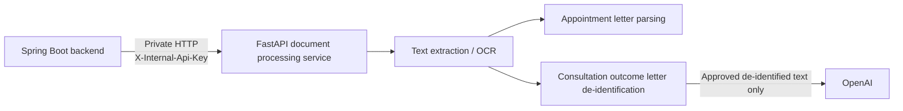

# The Appointment Pack Document Processing Service

The Appointment Pack helps patients and carers organise healthcare information and prepare for appointments. The wider application manages patient details, appointments, medications, contacts, blood results, medical history, healthcare documents, care access, appointment packs, activity history and administrator analytics.

This repository contains the **FastAPI document processing service**. It is a private service called by the Spring Boot backend for healthcare document extraction, OCR, appointment letter parsing, consultation outcome letter de-identification and approved-text summarisation.

## Overview

The service handles the document-processing parts of the application:

- embedded text extraction from PDFs.
- OCR for scanned PDF pages and uploaded JPEG/PNG images.
- image preprocessing before OCR where configured.
- deterministic appointment letter parsing.
- deterministic consultation outcome letter de-identification.
- OpenAI summarisation of approved de-identified consultation outcome letter text.

The service is stateless. Spring Boot keeps the document record, workflow status and any accepted clinical data. This keeps the processing code separate from application security and persistence.

## Architecture



The service is reached only by Spring Boot inside the application network:

```text
Angular frontend
-> Spring Boot backend
-> FastAPI document processing service
```

Appointment letters are processed locally. Consultation outcome letters are also extracted and de-identified locally. OpenAI is used only after the de-identified text has been reviewed and explicitly approved through the application.

## Processing Workflows

### Appointment letter

```text
PDF / JPEG / PNG
-> embedded text extraction or OCR
-> deterministic appointment letter parsing
-> structured suggestions
-> Spring Boot
-> human review and editing
-> confirmed appointment
```

The parser can suggest the appointment date, start and end time, service, appointment type, clinician or team, location and address. These values remain editable before the appointment is confirmed.

### Consultation outcome letter

```text
PDF / JPEG / PNG
-> embedded text extraction or OCR
-> deterministic local de-identification
-> Spring Boot / Angular privacy review
-> approved de-identified text
-> FastAPI
-> OpenAI summary
-> Spring Boot / Angular summary review
-> medical history if accepted
```

Deterministic de-identification reduces the personal information in the text but cannot guarantee anonymity. Human review is therefore part of the workflow before any text can be sent to OpenAI.

The summarisation request contains the approved de-identified text, not the original uploaded document.

## Technology

| Area | Technology |
|---|---|
| Language | Python `>=3.12,<3.13` |
| API framework | FastAPI 0.141.1 |
| ASGI server | Uvicorn 0.52.0 |
| Validation/settings | Pydantic and pydantic-settings |
| PDF processing | PyMuPDF 1.28.0 |
| Image handling | Pillow |
| OCR adapter | pytesseract |
| OCR engine | Tesseract |
| Image preprocessing | NumPy and OpenCV headless |
| External AI | OpenAI Python SDK 2.53.0 |
| Testing | pytest 9.1.1 and httpx |
| Lint/format | Ruff 0.15.22 |
| Packaging | setuptools |

OCR, PDF processing and OpenAI client work use Starlette's thread pool so blocking processing does not run directly on the FastAPI event loop.

## Project Structure

```text
src/appointment_pack_processing/
├── app.py
├── config.py
├── main.py
├── schemas.py
├── api/
│   ├── dependencies.py
│   └── routes/
│       ├── documents.py
│       └── health.py
└── services/
    ├── appointment_details_service.py
    ├── deidentification_service.py
    ├── document_processing_service.py
    ├── image_preprocessing_service.py
    ├── ocr_service.py
    ├── openai_summary_service.py
    └── text_extraction_service.py
```

`main.py` provides the Uvicorn entry point. `app.py` creates the FastAPI application and processing services. HTTP route handling stays under `api/`, while the document-processing logic stays under `services/`.

## API

The service exposes three routes:

| Method | Endpoint | Access | Purpose |
|---|---|---|---|
| GET | `/health` | Private network | Return service health information |
| POST | `/internal/v1/documents/extract` | `X-Internal-Api-Key` | Extract text and process an appointment or consultation outcome letter |
| POST | `/internal/v1/documents/summarise` | `X-Internal-Api-Key` | Summarise approved de-identified consultation outcome letter text |

### Internal authentication

The two processing endpoints require:

```http
X-Internal-Api-Key: <shared-secret>
```

The key must match the value configured in Spring Boot.

### Extraction

```text
POST /internal/v1/documents/extract
Content-Type: multipart/form-data
```

Multipart fields:

| Field | Purpose |
|---|---|
| `documentId` | Document UUID supplied by Spring Boot |
| `documentType` | `APPOINTMENT_LETTER` or `CONSULTATION_OUTCOME_LETTER` |
| `redactionContext` | JSON containing known values used during consultation outcome letter de-identification |
| `file` | PDF, JPEG or PNG document |

For appointment letters, the response contains extracted text and structured appointment suggestions. For consultation outcome letters, it contains extracted text, the de-identified text and a review warning.

### Summarisation

```text
POST /internal/v1/documents/summarise
Content-Type: application/json
```

Request:

```json
{
  "documentId": "uuid",
  "approvedDeidentifiedText": "exact reviewed snapshot"
}
```

The response contains the generated summary together with the processor version, model name and prompt version used for the request.

## Configuration

Configuration uses `pydantic-settings` with the `APP_` prefix.

| Variable | Purpose | Required |
|---|---|---|
| `APP_INTERNAL_API_KEY` | Shared Spring Boot to FastAPI key | Yes |
| `APP_ENVIRONMENT` | Runtime environment | No |
| `APP_MAXIMUM_FILE_SIZE_BYTES` | Maximum document size | No |
| `APP_MAXIMUM_PDF_PAGES` | Maximum PDF page count | No |
| `APP_OCR_LANGUAGE` | Tesseract language | No |
| `APP_OCR_DPI` | DPI used when rendering PDF pages for OCR | No |
| `APP_OCR_PREPROCESSING_ENABLED` | Enable OCR image preprocessing | No |
| `APP_OCR_MINIMUM_IMAGE_WIDTH` | Width used when deciding whether an image should be enlarged | No |
| `APP_TESSERACT_COMMAND` | Optional Tesseract executable path | No |
| `APP_OPENAI_API_KEY` | OpenAI API key | Required for summarisation |
| `APP_OPENAI_MODEL` | OpenAI model | No |
| `APP_OPENAI_TIMEOUT_SECONDS` | OpenAI timeout | No |
| `APP_OPENAI_MAX_OUTPUT_TOKENS` | Summary output token limit | No |
| `APP_OPENAI_PROMPT_VERSION` | Prompt version recorded with summaries | No |
| `APP_MAXIMUM_AI_INPUT_CHARACTERS` | Maximum approved text size | No |

Useful defaults include a 10 MiB file limit, a 50-page PDF limit, English OCR at 300 DPI, and `gpt-5-nano` as the OpenAI model.

Real internal and OpenAI keys should be supplied through the environment and kept out of source control.

## Local Development

Use Python 3.12. Tesseract must also be installed locally or configured through `APP_TESSERACT_COMMAND`.

Create a virtual environment:

```bash
python -m venv .venv
```

Activate it using the normal command for the operating system, then install the project and development dependencies:

```bash
python -m pip install -e '.[dev]'
```

Run the service:

```bash
uvicorn appointment_pack_processing.main:app --host 0.0.0.0 --port 8000
```

The health endpoint is available at:

```text
http://localhost:8000/health
```

For full application development, Spring Boot should be configured with the same internal API key and the local FastAPI address.

## Testing

The repository uses pytest for automated tests and Ruff for linting and formatting checks. The tests cover:

- the private HTTP API and internal key checks.
- upload size and media type validation.
- PDF and image extraction.
- OCR handling and image preprocessing.
- deterministic appointment letter parsing.
- deterministic consultation outcome letter de-identification.
- OpenAI response validation and error handling.

Run the standard checks with:

```bash
pytest
ruff check .
ruff format --check .
python -m compileall -q src
```

## Production Deployment

Production runs as part of a shared Docker Compose stack with four main services:

```text
frontend
backend
postgres
document-processing
```

The document processing service sits behind the Spring Boot backend:

```text
Internet
-> Cloudflare
-> Cloudflare Tunnel
-> Nginx / Angular frontend
-> Spring Boot backend
   -> PostgreSQL
   -> FastAPI document processing service
      -> local extraction and OCR
      -> deterministic appointment letter parsing
      -> deterministic consultation outcome letter de-identification
      -> OpenAI for approved de-identified consultation outcome letter text only
```

The FastAPI application runs in its own `document-processing` container. It is separate from both the Spring Boot and PostgreSQL containers. Spring Boot reaches it through the private Docker network at:

```text
document-processing:8000
```

Port `8000` is not published as a public application port. The service remains private to the Compose network and stores no persistent application data itself.

The production image uses Python 3.12, includes Tesseract and runs the FastAPI application as a non-root user.

## Related Components

The application is split across three repositories:

- **Angular frontend**: browser presentation, forms, routing and selected patient state.
- **Spring Boot backend**: authentication, permissions, workflow rules, database access, document storage, appointment packs, activity history and administration.
- **FastAPI document processing service**: this repository. It handles local healthcare document processing and approved-text consultation outcome letter summarisation.
